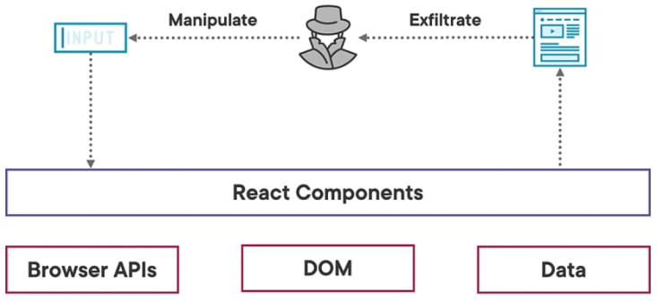
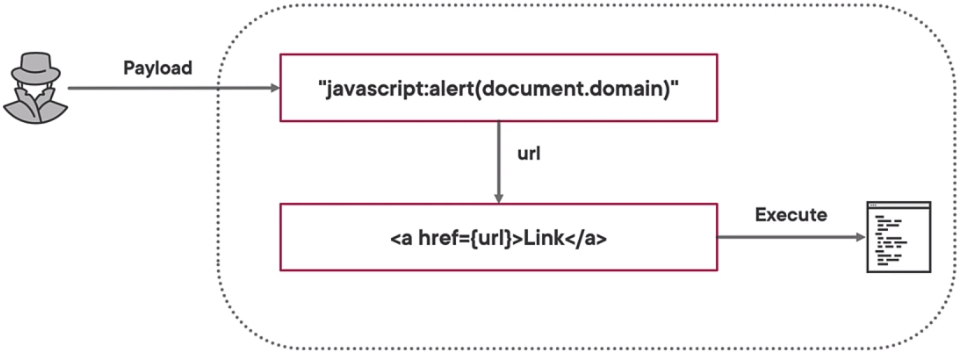

# React Security

# Cross-site Scripting (XSS)
- This is done by embading some writing on to the url to gain access

1. Attacker submits malicious payload or link
2. The browser turns the payload into executable code.
3. Malicious code exfiltrates data or performs other actions.

## Impact of XSS Attacks
1. Stealing sensitive data.
2. Sending data receiving data.
2. Installing malware like keyloggers.
4. Account and session takeover.
5. Launching phishing attacks.
6. Evading security controls.

## DOM XSS Sourcing
- Sources are easily manipulated by attackers and are how malicious payloads are delivered to the application:
1. URLs
2. Cookies
3. Storage APIs

## JavaScript URLs in React

# Prevent XSS when Parsing Components by:
1. Avoid untrustedinput - Accepting untrusted code can easily lead to XSS.
2. Sanitize with DOMPurify - can be acceptable if components are pure HTML.

# Benefits of Server-side Rendering(SSR)
1. Better Performance - For complex application logic it might be faster to render on the server.
2. Faster load time -  initial response comes with initial data, saving a road trip to the server.